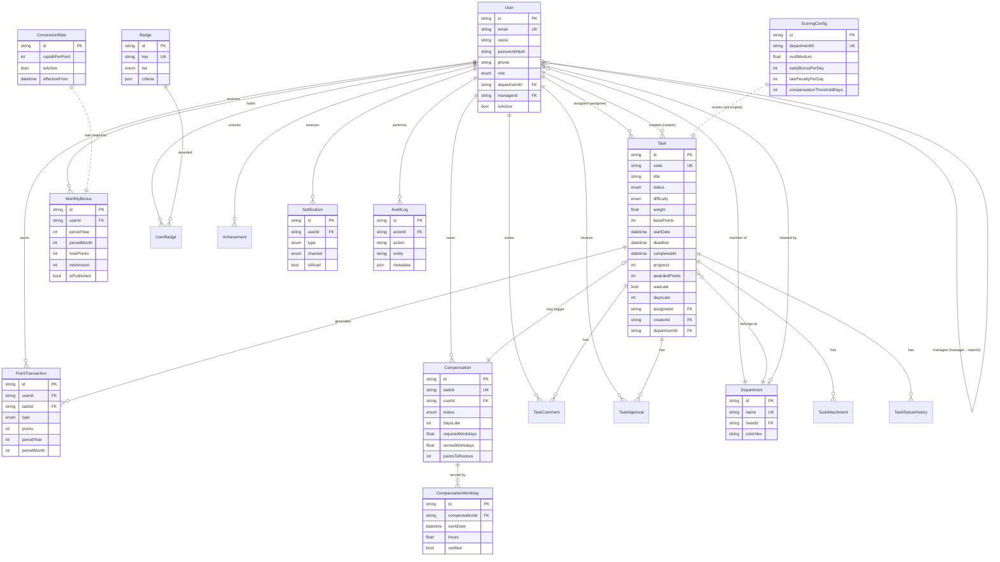
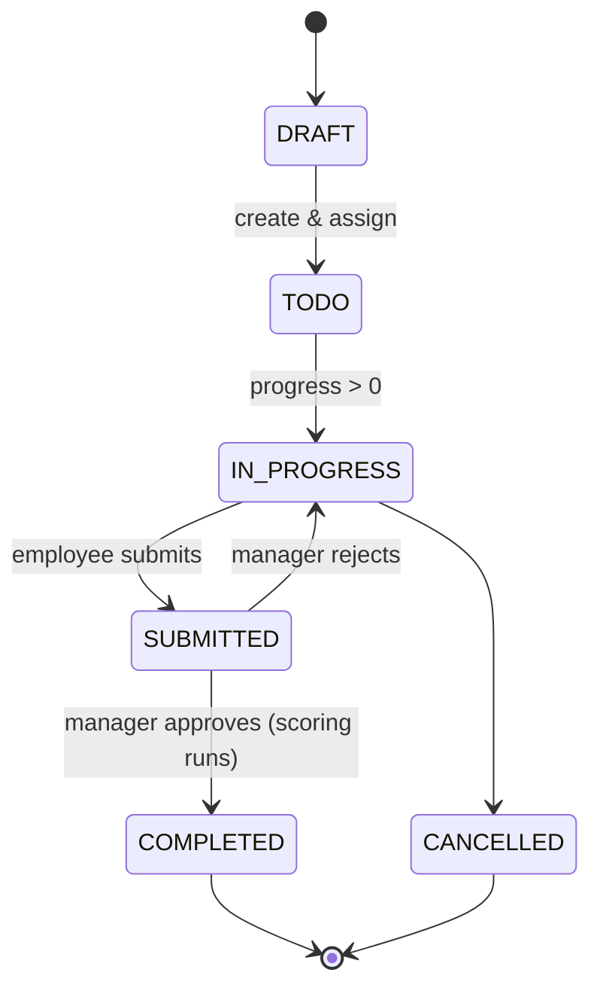

# Database Schema & ERD — Rustika PMS

PostgreSQL 16 · Prisma 6. Full source: [`prisma/schema.prisma`](../prisma/schema.prisma).

## 1. Entity-Relationship Diagram



## 2. Domains & Tables

### Identity & Organization
| Model | Purpose |
| --- | --- |
| `User` | People + auth + role + org links (department, manager→reports self-relation) |
| `Department` | Org unit; optional `head` (a User); members & tasks |
| `Account` / `Session` / `VerificationToken` | NextAuth adapter tables |

### Task Management
| Model | Purpose |
| --- | --- |
| `Task` | Core work item. Lifecycle in `status`; scoring inputs (`basePoints`, `difficulty`, `weight`); denormalized results (`awardedPoints`, `wasLate`, `daysLate`) |
| `TaskAttachment` | Uploaded files (S3 URL + metadata) |
| `TaskComment` | Threaded discussion |
| `TaskApproval` | Reviewer decision record |
| `TaskStatusHistory` | Immutable audit of every status transition |

### Points & Money
| Model | Purpose |
| --- | --- |
| `PointTransaction` | Append-only ledger; one row per scoring component; bucketed by `(periodYear, periodMonth)` |
| `ScoringConfig` | Tunable multipliers, bonus/penalty rates & caps, compensation rules (global or per-department) |
| `ConversionRate` | Effective-dated `rupiahPerPoint` |
| `MonthlyBonus` | Per-user, per-period computed bonus with published lock |

### Compensation
| Model | Purpose |
| --- | --- |
| `Compensation` | Obligation opened when a task is late beyond threshold |
| `CompensationWorkday` | Logged weekend/holiday make-up days, with proof & verification |

### Gamification / Notifications / Platform
| Model | Purpose |
| --- | --- |
| `Badge` / `UserBadge` / `Achievement` | Gamification |
| `Notification` | Multi-channel (`IN_APP`/`EMAIL`/`WHATSAPP`) with delivery tracking |
| `AuditLog` | Security/compliance trail |
| `SystemSetting` | Arbitrary JSON config |
| `Holiday` | Non-working days for SLA & compensation date math |

## 3. Enums

- `Role` — `SUPER_ADMIN | MANAGER | EMPLOYEE`
- `TaskStatus` — `DRAFT → PENDING_APPROVAL → TODO → IN_PROGRESS → SUBMITTED → APPROVED/REJECTED → COMPLETED | CANCELLED`
- `Difficulty` — `TRIVIAL | EASY | MEDIUM | HARD | CRITICAL`
- `PointType` — `BASE | EARLY_BONUS | LATE_PENALTY | … | COMPENSATION_CREDIT`
- `CompensationStatus` — `OPEN | IN_PROGRESS | SUBMITTED | VERIFIED | WAIVED`
- `NotificationType` / `NotificationChannel` / `BadgeTier` / `ApprovalDecision`

## 4. Task Status Lifecycle



## 5. Indexing Strategy

| Index | Why |
| --- | --- |
| `PointTransaction(userId, periodYear, periodMonth)` | O(log n) monthly point aggregation per user |
| `Task(status)`, `Task(deadline)`, `Task(assigneeId)` | Dashboard & reminder queries |
| `Notification(userId, isRead)` | Unread badge counts |
| `MonthlyBonus(userId, periodYear, periodMonth)` UK | Idempotent upsert per period |
| `Compensation(userId)`, `Compensation(status)` | Obligation lookups |
| `AuditLog(entity, entityId)`, `AuditLog(createdAt)` | Compliance search |

## 6. Data Integrity Rules

- Point awards are **append-only** — corrections add reversing rows, never edits.
- All scoring writes occur in a **single transaction** with the task transition.
- `Compensation` is 1:1 with `Task` (`taskId UK`); `pointsToRestore` is credited
  back via a `COMPENSATION_CREDIT` transaction only on `VERIFIED`.
- `MonthlyBonus` `update` is skipped once `isPublished = true` (amount lock).
- Cascade deletes: child rows (`TaskAttachment`, `CompensationWorkday`, …) follow
  their parent; org references (`departmentId`, `managerId`) use `SetNull`.

## 7. Migrations

```bash
npm run prisma:migrate     # dev: create + apply a named migration
npm run prisma:deploy      # prod: apply committed migrations
npm run prisma:studio      # visual data browser
```
